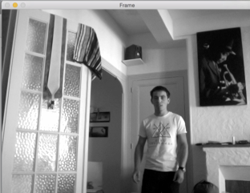
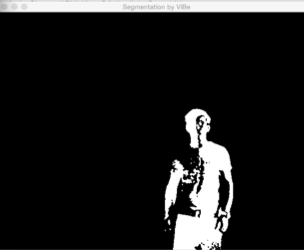

## Continuous EEG records and artifacts

This program is a tool we used along with EEG recording software. Upon recording of continuous ICU EEGs we noticed that most artifacts correspond to periods of caregiving. In order for subsequent analysis methods to _exclude potentially artifacted signal_ we found it useful to use real time video analysis to tag periods of caregiving. For this purpose, this simple program does real-time foreground/background segmentation on a webcam and outputs a time-stamped textfile with the number of pixels in the foreground each 100 frames. 

## Dependencies

OpenCV. 

## Background segmentation

This foreground/background segmentation part of the program is based on the paper and code from the [ViBe algorithm](http://www.telecom.ulg.ac.be/research/vibe/) by Barnich et al. 

Original image:

Segmented image:

